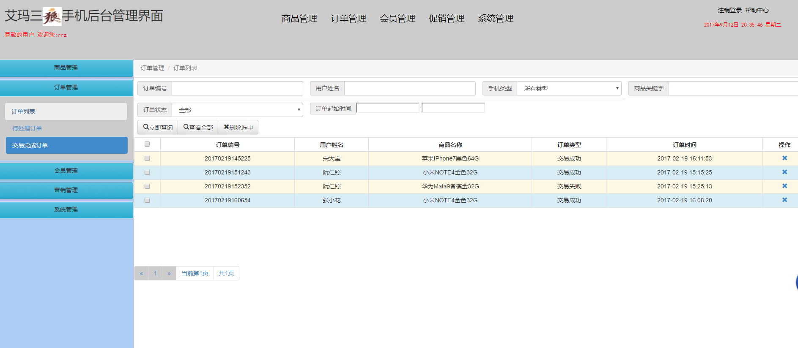

# OOAD小组作  
## 周惠0913620    苏婷0914615   孙雪09143676   袁婷09143681    
=====
#1.各种图  
##类图

====
##登录时序图

====
##查询订单明细时序图

====
##商品管理用例图

====
##会员及等级管理用例图

====
##订单管理用例图

====
##框架图

====
#2.操作截图
====

====

====
###商品管理

====

====
###订单管理

====

====

====
###会员管理

====

====
###营销管理

====

====
###系统管理

====
                                                                                                                                                                                                                                                                                                                                                                                                                                                                                                                                                                                                                                                                                                                                                                                                                                                                                                                                                                                                                                                                                                                                                                                                                                                                                                                                                                                                                                                                                                                                                                                                                                                                                                                                                                                                                                                                                                                                                                                                                                                                                                                                                                                                                                                                                                                                                                                                                                                                                                               )

